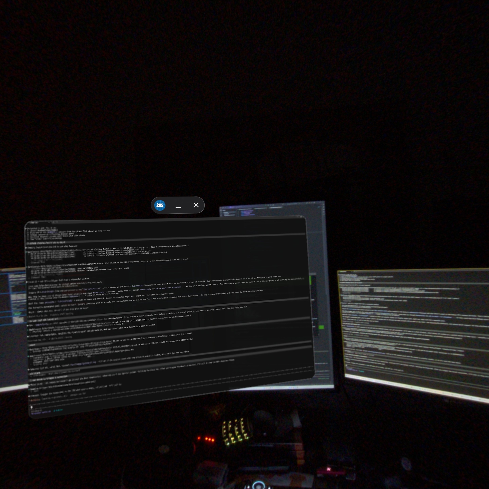
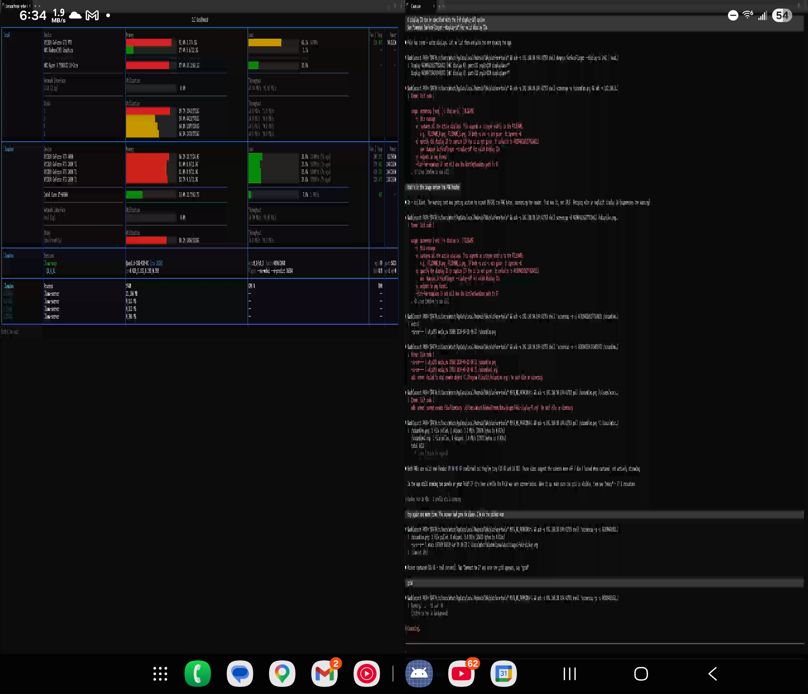
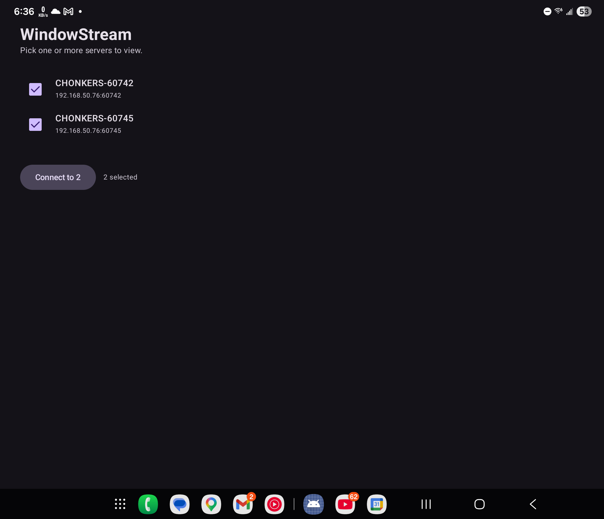

# WindowStream

Stream individual Windows app windows to headsets and phones as first-class XR / spatial objects.

Pick a window on your PC, encode it live with NVENC, ship the frames over LAN, and see it floating in 3D space on a Galaxy XR — or as a 2D panel on a Quest, phone, or tablet. Keyboard input routes back. Multiple windows can be streamed at once.

<p align="center">
  
  <br />
  <sub><i>First-person capture through a Samsung Galaxy XR. The floating panel is a live PC window streamed from the desk behind the author.</i></sub>
</p>

<p align="center">
  
  <br />
  <sub><i>Two PC windows streamed simultaneously to a Galaxy Z Fold 6. Left panel: this repo's source-code window. Right panel: a live <code>python</code> dashboard on the same PC.</i></sub>
</p>

<p align="center">
  
  <br />
  <sub><i>Multi-select server picker. Servers auto-discover over mDNS; tick the ones you want to stream simultaneously.</i></sub>
</p>

**Status:** working proof-of-concept. Validated end-to-end on the author's LAN across three viewer platforms. Not production-ready — no release builds, rough edges, known latency issues, no packaging for non-developers yet. Built in two YOLO-mode sessions with [Claude Code](https://claude.com/claude-code).

## What works today

- **PC side:** Windows 11 + .NET 8 + NVIDIA NVENC. Pick any top-level window by handle, capture it with Windows.Graphics.Capture, encode H.264, send over TCP (control) + UDP (video).
- **Galaxy XR viewer** (`gxr` Gradle flavor): immersive `SpatialExternalSurface` panel via Jetpack XR. Floats in world space.
- **Quest 3 / Android phone / tablet / Galaxy Fold viewer** (`portable` flavor): plain `SurfaceView` renders the stream as a 2D window in Horizon OS home space or on a phone screen.
- **Multi-window:** run N server processes on the PC (one per window), the viewer's multi-select picker discovers all of them via mDNS, tap "Connect to N" and tiles them into a grid.
- **Input relay:** paired Bluetooth keyboard → the viewer → the control channel → Win32 `SendInput` into the focused PC window. Soft keyboard also works on the Fold with an on-screen preview bar.
- **Auto-discovery:** server advertises `_windowstream._tcp` via Makaretu.Dns mDNS; viewer discovers via Android NSD.

## The obvious limitations

- **Latency is janky.** Next on the list: `MediaFormat.KEY_LOW_LATENCY` on the viewer, NVENC `p1` preset + `-tune ull` on the server, end-to-end round-trip measurement to prioritize. Currently feels like "several hundred ms" round-trip — fine for watching a terminal, wrong for playing a video game.
- **First-run setup requires admin.** Windows Firewall has to be on the `Private` profile (for mDNS) and firewall rules need to be added per session (ephemeral ports). A binary-based rule on `windowstream.exe` would fix that but isn't in yet.
- **FFmpeg DLLs.** The server grabs FFmpeg 7.x native DLLs from `$(ProgramFiles)\obs-studio\bin\64bit\` as a stopgap. If you don't have OBS installed, the server won't start.
- **Keyboard polish.** Soft-keyboard Enter doesn't clear the buffer, backspace-on-empty doesn't relay. US layouts only. Modifier-key state machine is pending. See [multi-window followups doc](docs/superpowers/specs/2026-04-20-multi-window-followups.md).
- **Per-stream input routing.** In multi-window mode, keyboard input only reaches the first selected server. Tap-to-focus on a specific panel is a future pass.
- **No release APK.** Sideload via `adb install -r` from a debug build.
- **Samsung Galaxy XR home-space quirk.** The immersive activity sometimes gets minimized by the XR home pool right after launch. Reopen the app if the panel doesn't appear.

## Architecture

See the full design document: [`docs/superpowers/specs/2026-04-19-windowstream-design.md`](docs/superpowers/specs/2026-04-19-windowstream-design.md).

Briefly:

- **Protocol:** TCP for control (`CLIENT_HELLO`, `SERVER_HELLO`, `VIEWER_READY`, `STREAM_STARTED`, `REQUEST_KEYFRAME`, `HEARTBEAT`, `KEY_EVENT`, all JSON-framed with a length prefix) + UDP for video (fragmented H.264 payloads with sequence/stream headers).
- **Server:** `WindowStream.Core` (capture / encode / session state, multi-targeted `net8.0` + `net8.0-windows10.0.19041.0`) + `WindowStream.Cli` (Windows-only CLI harness wiring real WGC capture, FFmpeg NVENC encoder, and TCP/UDP adapters).
- **Viewer:** single Gradle Android module, two flavors (`gxr`, `portable`). Shared code for discovery, control protocol, UDP transport, MediaCodec decode. Flavor-specific LAUNCHER activity.
- **Tests:** 100% line + branch coverage gate enforced on `WindowStream.Core` via Coverlet and on the viewer via Kover (lifecycle entry points + synthetic kotlinx continuation branches excluded with documented rationale). Integration tests cover NVENC init + SessionHost loopback on Windows; a Gradle Managed Device test exercises the full viewer pipeline on a Pixel 6 API 36 emulator.

## Running it

### Server (Windows 11 PC, NVIDIA GPU, OBS installed)

```bash
dotnet restore
dotnet build
# list candidate source windows
dotnet run --project src/WindowStream.Cli -f net8.0-windows10.0.19041.0 -- list
# serve a window by HWND
dotnet run --project src/WindowStream.Cli -f net8.0-windows10.0.19041.0 -- serve --hwnd <handle>
```

Note the TCP/UDP ports printed in the banner, add Windows Firewall allow rules for them, make sure your LAN is on the `Private` network profile.

### Viewer (any Android 14+ device, same LAN)

```bash
# portable flavor (Quest / phone / tablet / Fold / Galaxy XR as 2D)
./gradlew :app:assemblePortableDebug
adb install -r viewer/WindowStreamViewer/app/build/outputs/apk/portable/debug/app-portable-debug.apk
# -or- GXR flavor (Samsung Galaxy XR immersive panel)
./gradlew :app:assembleGxrDebug
adb install -r viewer/WindowStreamViewer/app/build/outputs/apk/gxr/debug/app-gxr-debug.apk
```

Launch the **WindowStream Viewer** icon. The picker auto-discovers servers on your LAN; tap one (or multiple, portable flavor only) and tap **Connect**.

## Stack

- **Server:** .NET 8, Windows.Graphics.Capture, FFmpeg 7 via FFmpeg.AutoGen, Makaretu.Dns.
- **Viewer:** Kotlin 2.0, Jetpack Compose + Jetpack XR (`gxr` flavor), MediaCodec, kotlinx-coroutines, kotlinx-serialization, Android NSD.
- **Tests:** xUnit + Coverlet, JUnit Jupiter + Kover (JaCoCo engine), Gradle Managed Devices.

## License

[MIT](LICENSE). Have fun.

## Credit

Built in collaboration with [Claude Code](https://claude.com/claude-code) (Opus 4.7, 1M context). Claude gets the `Co-Authored-By` byline on every commit; the author gets the hardware to validate it on and a very patient Samsung Galaxy XR.

See the commit log for the narrative. Start with `7079049` (the v1 thesis proved).
