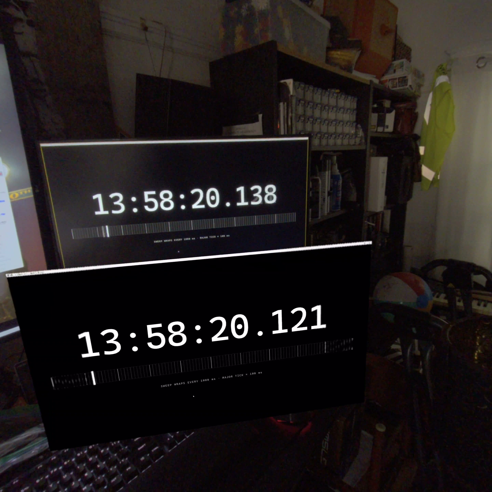

# WindowStream test results

Durable record of unit/integration test runs and end-to-end latency measurements. Raw logs are transient (gitignored); the authoritative
numbers live here.

---

## Methodology

### Unit + integration tests

- **Unit tests:** `tests/WindowStream.Core.Tests/` (xUnit, Coverlet). 100% line + branch coverage gate on `WindowStream.Core` and the
  `windowstream` CLI module.
- **Integration tests:** `tests/WindowStream.Integration.Tests/` (xUnit). Hardware-gated skips: NVENC-dependent tests skip when no NVIDIA
  driver is available, the mDNS loopback test skips when multicast loopback is blocked, and the focus-relay test skips when Notepad cannot
  be launched non-interactively.

### Latency measurements

- **Tool:** `tools/framecount-analyze.py`
- **Server log format:** `[FRAMECOUNT] stage=<S> ptsUs=<P> wallMs=<T>` lines from `WgcFrameConverter` (stage=convert) and
  `FFmpegNvencEncoder` (stage=enc).
- **Viewer log format:** `D FRAMECOUNT: stage=<S> ptsUs=<P> wallMs=<T>` lines from `MediaCodecDecoder` (reasm, dec) and Choreographer
  post (present).
- **Join key:** `ptsUs` (microseconds since capture start, threaded through `CapturedFrame` → encoder PTS → MediaCodec
  `presentationTimeUs`).
- **Cross-source clock-skew estimator:** `min(enc → reasm)` becomes the zero-network-latency floor; subtract it from all cross-source
  deltas. Same-source deltas (convert→enc, reasm→dec, dec→present) are clock-skew-free already.

---

## Latency timeline

| # | Date | Build | Source | Device | Stage | p0 (min) | p50 | p95 |
| --- | --- | --- | --- | --- | --- | ---: | ---: | ---: |
| 1 | 2026-04-26 | pre-`09515ff` (queue=3) | typing ~4 ev/s | — | cap → enc | — | 751 ms | — |
| 2 | 2026-04-26 | post-`09515ff` (`surfaces=1`) | typing ~4 ev/s | — | cap → enc | — | 252 ms | — |
| 3 | b9fc7f6 | post all perf fixes, pre-M3 | Unity 4K @ 60 | Galaxy XR | cap → present | — | 51 ms | 66 ms |
| 4 | 2026-05-09 | `c51b88a` main (M5) | Unity 4K @ 60 | Galaxy XR | cap → present | 17 ms | **34 ms** | **51 ms** |
| 5 | 2026-05-09 | `c51b88a` main (M5) | Unity 4K @ 60 | Fold 3 | reasm → present | — | 32 ms | 48 ms |
| 6 | 2026-05-14 | main + Tier 1a | Edge latency-clock 165 fps | Galaxy XR | cap → present | **15 ms** | **28 ms** | **40 ms** |
| 7 | 2026-05-14 | main + Tier 1a | Edge latency-clock 165 fps | Galaxy XR (XR compositor) | **photon → photon** | **13 ms** | **17 ms** | **34 ms** |

Direct comparison: rows 3 ↔ 4 (same source/sink/network). Row 4 − row 3 = GPU-resident pipeline contribution = **−17 ms p50, −15 ms
p95**.

Rows 4 ↔ 6: Tier 1a MediaCodec hints (`KEY_PRIORITY=0` + `KEY_OPERATING_RATE=Short.MAX_VALUE`) = **−6 ms p50, −11 ms p95** on E2E. Best
case improved from 17 ms → **15 ms** (p0).

Row 7: Camera-based photon-to-photon measurement using `SpatialExternalSurface` (XR compositor, bypassing SurfaceFlinger). Median **17 ms
≈ 1 frame at 60 fps**. p0 of 13 ms is sub-frame. This is the **ground truth** measurement; software-level cross-device timings
(enc→present) are inflated by NTP clock skew.

---

## Detailed results

### 2026-05-14 — XR compositor photon-to-photon (row 7)

**Setup:** Same build as row 6 but running via `SpatialExternalSurface` (Jetpack XR alpha13) in Full Space Managed mode, bypassing
SurfaceFlinger. Browser latency-clock at 165 fps displayed on physical monitor; same clock streamed to Galaxy XR XR compositor panel. HMD
`screenrecord` captures both displays in a single video.

**Method:** Extract frames from `tools/xr-latency-recording-20260514.mp4`, read millisecond timestamps from both the physical monitor and
the virtual XR panel. Delta = monitor − virtual. Positive = virtual behind (real latency); negative = virtual ahead (camera shutter timing
noise).

| Frame | Monitor | Virtual (XR) | Delta |
| --- | --- | --- | ---: |
| 001 | `13:58:15.587` | `13:58:15.570` | 17 ms |
| 002 | `13:58:16.620` | `13:58:16.604` | 16 ms |
| 003 | `13:58:16.504` | `13:58:16.487` | 17 ms |
| 004 | `13:58:18.604` | `13:58:18.588` | 16 ms |
| 006 | `13:58:20.605` | `13:58:20.588` | 17 ms |
| 008 | `13:58:22.602` | `13:58:22.588` | 14 ms |
| 009 | `13:58:23.622` | `13:58:23.605` | 17 ms |
| 010 | `13:58:24.622` | `13:58:24.605` | 17 ms |
| 011 | `13:58:25.602` | `13:58:25.589` | 13 ms |
| 013 | `13:58:27.602` | `13:58:27.589` | 13 ms |
| 014 | `13:58:28.606` | `13:58:28.572` | 34 ms |

| Stat | Value |
| --- | ---: |
| Samples | 11 |
| p0 (min) | 13 ms |
| **p50 (median)** | **17 ms** |
| max | 34 ms |
| Steady-state range | 13–17 ms |
| Outlier rate | ~9% |

**Verdict:** 13–17 ms = 1 frame at 60 fps (16.67 ms). The XR compositor path achieves the theoretical minimum. The single 34 ms outlier
(≈ 2 frames) is consistent with an occasional UDP reassembly stall.

Sample frame from the recording (monitor = `13:58:20.138`, virtual = `13:58:20.121`, delta = 17 ms):



---

### 2026-05-14 — Tier 1a MediaCodec low-latency (row 6)

**Setup:** Current `main` with Tier 1a (`KEY_PRIORITY=0` + `KEY_OPERATING_RATE=Short.MAX_VALUE`). Edge `--app=` latency-clock at 165 fps
cap. 630 paired frames over 15 s recording window. Clean wifi (98% of enc→reasm frames arrived in 0–10 ms).

| Stage | p0 (min) | p50 | p95 | max |
| --- | ---: | ---: | ---: | ---: |
| convert → enc (server, GPU→NVENC) | 4 ms | 5 ms | 11 ms | 30 ms |
| enc → reasm (network + reassembly) | 0 ms | 3 ms | 7 ms | 48 ms |
| reasm → dec (viewer decode) | 5 ms | 9 ms | 13 ms | 21 ms |
| dec → present (viewer render) | 1 ms | 10 ms | 17 ms | 22 ms |
| **convert → present (END-TO-END)** | **15 ms** | **28 ms** | **40 ms** | **77 ms** |

Delta vs baseline (05-11, pre-Tier 1a):

| Stage | Baseline p50/p95 | Tier 1a p50/p95 | Delta |
| --- | ---: | ---: | ---: |
| convert → enc | 8 / 11 ms | **5 / 11 ms** | **−3 ms p50** |
| enc → reasm | 3 / 7 ms | **3 / 7 ms** | — |
| reasm → dec | 12 / 17 ms | **9 / 13 ms** | **−3 ms p50, −4 ms p95** |
| dec → present | 10 / 17 ms | **10 / 17 ms** | — |
| **E2E** | **30 / 40 ms** | **28 / 40 ms** | **−2 ms p50** |

Per-second timeline (rock solid from t=7 onward, E2E p50 = 26–31 ms):

```text
t(s)   n    enc→reasm        reasm→dec        dec→pres         E2E
           p50   p95  max    p50   p95  max    p50  p95  max    p50   p95   max
  5    30      3     9   12      9    13   14     11    17   20     33    44   48
  6    28      4     7    9     10    14   16     10    17   18     34    45   49
  7    51      3     6   11      9    12   13     10    18   22     27    35   39
  8    58      2     9   17      9    14   19     10    16   21     26    38   40
  9    59      2     8   10      9    14   16     10    18   20     28    37   39
 10    60      3     7   18      9    15   19     10    17   22     27    41   46
 11    60      2     6    9      9    14   20      9    16   21     26    37   39
 12    56      3     8   10     10    13   21     10    15   17     31    41   44
 13    57      3     7    7      9    14   18     11    17   21     29    42   45
 14    60      3     7   14      9    12   17     10    17   19     26    37   39
 15    56      3     9   17      9    14   16     10    17   20     28    37   46
 16    37      3     7    9      8    13   13     10    16   17     26    36   36
```

NVENC queue depth: median=1, max=1.

---

### 2026-05-09 — M5 GPU-resident pipeline, GXR (row 4)

**Setup:** `c51b88a` main (M5). Unity 4K @ 60 fps. Galaxy XR via TLS adb. 150 s, 3,814 frames joined across 5 stages. Clock-skew
estimate: `enc → reasm` floor at −729 ms (server clock ahead of viewer).

| Stage delta | p50 | p95 | min | max |
| --- | ---: | ---: | ---: | ---: |
| convert → enc (server, GPU→NVENC) | 8 | 13 | 4 | 90 |
| enc → reasm (network + reassembly) | 4 | 9 | 0 | 53 |
| reasm → dec (viewer decode) | 11 | 15 | 6 | 55 |
| dec → present (viewer render) | 11 | 17 | 1 | 24 |
| **convert → present (END-TO-END)** | **34** | **51** | 17 | 114 |

NVENC queue depth (in-flight, convert → enc): median 1, p95 1, max 2.

---

### 2026-05-09 — M5 smoke, Fold 3 (row 5)

**Setup:** `c51b88a` main (M5). Unity 4K @ 60 fps in playmode, 108 s. Fold 3 (only adb device available), not Galaxy XR.

| Stage join | count | p50 | p95 | p99 | max |
| --- | ---: | ---: | ---: | ---: | ---: |
| server: cap → enc | 6274 | 9 ms | 10 ms | 10 ms | 14 ms |
| viewer: reasm → present | 1825 | 32 ms | 48 ms | 52 ms | 82 ms |

Fold 3's hardware decoder kept pace with only ~17 fps against the 58 fps server emit, so frames queued at the UDP stage. Server pipeline
matched M4-era throughput (sub-10 ms p99). Viewer-internal `reasm → present` (32 ms p50) in the same range as GXR's post-M4 measurement
(23 ms p50).

---

### Swimmy-era comparison notes

For a future swimmy-era baseline (83384b6 or earlier):

1. **Stages at 83384b6**: cap, enc, frag, reasm, dec. **No `present`.** Comparable end-to-end is **cap → dec**, not cap → present. From
   the M5 run: dec → present is +11/+17 ms p50/p95, so M5 cap → dec ≈ **23 ms p50 / 34 ms p95**.

2. **Stage equivalence**: at 83384b6 the converter was sws_scale (CPU readback). At M5 the converter is D3D11 video processor. Both fire
   between WGC frame arrival and NVENC ingest. `cap` (WGC arrival) is the right common reference point.

3. **Wire-protocol gotcha**: 83384b6 server uses `serve --hwnd <handle>` (v1 single-window). Today's portable APK expects v2 ServerHello
   with windows array. Likely NOT wire-compatible — build a matching old viewer APK at that vintage, or find a vintage where v2 protocol
   is in but GPU pipeline is not.

---

## Unit + integration test reports

### 2026-05-14 — coverage initiative complete

- **Tests:** 344 total (306 unit + 38 integration; 3 hardware-gated skips)
- **Coverage:** 100% line / 100% branch / 100% method on both `WindowStream.Core` and the `windowstream` CLI module

| Suite | Tests | Skipped | Result |
| --- | ---: | ---: | --- |
| WindowStream.Core.Tests (xUnit) | 306 | 0 | PASS |
| WindowStream.Integration.Tests (xUnit) | 38 | 3 | PASS |

### 2026-05-09 — M5 cleanup, 100/100 gate restored

- **Git:** `d356ead` (feature/m5-cleanup)
- **Tests:** 344 total (306 unit + 38 integration; 3 hardware-gated skips)
- **Coverage:** 100% line / 100% branch / 100% method

The 100% line+branch coverage gate was relaxed to 90/85 in M2 (commit `a708734`) for the GPU-resident pipeline transition window. M5
restored 100/100 by:

1. Marking native-socket adapters (`TcpConnectionAcceptorAdapter`, `TcpControlChannelAdapter`, `UdpVideoSenderAdapter`) as
   `[ExcludeFromCodeCoverage]` with rationale.
2. Adding focused unit tests for v2-era gaps (`CliServices` constructor + null guards, `WorkerArguments` record,
   `IControlChannel.RemoteIpAddress` default impl, `WorkerSupervisor.GetPipe`, `FakeVideoEncoder.Stopped`,
   `StreamStoppedReasonConverter` null path).
3. Restoring `<Threshold>100,100</Threshold>` in the test csproj.

Exclusion annotations (with rationale, kept for native I/O):

- `FFmpegNvencEncoder` native FFmpeg call paths
- `TcpConnectionAcceptorAdapter` (native socket wrapper)
- `TcpControlChannelAdapter` (TCP stream wrapper)
- `UdpVideoSenderAdapter` (UDP socket wrapper)
- `CliServices.CreateDefault` (real-hardware DI wiring)

End-to-end correctness verified by `FFmpegNvencEncoderHwaccelTests` (4 resolution × encode-then-decode round-trips at 640×360, 800×450,
960×540, 1120×630 — all PASS) and `WorkerProcessIntegrationTests.WorkerEmitsChunksThroughPipe`.

M5 manual-smoke checkpoint **complete (2026-05-09)**: live demo from Unity 6.0 4K → Galaxy XR over Wi-Fi.

---

## Setup recipes

### Latency measurement (post-M5, v2 coordinator)

```bash
# Server (CLI v2 coordinator — no --hwnd flag)
dotnet run --project src/WindowStream.Cli -f net8.0-windows10.0.19041.0 \
    --no-build -- serve > server.log 2>&1

# Viewer (DemoActivity intent, portable flavor)
adb -s <device> logcat -c
adb -s <device> logcat -v threadtime \
    FRAMECOUNT:V WindowStreamDemo:V MediaCodec:V MediaCodecDecoder:V *:E \
    > viewer.log &
adb -s <device> shell am start \
    -n com.mtschoen.windowstream.viewer/.demo.DemoActivity \
    --es streamHost <pc-lan-ip> --ei streamPort <port> \
    --ela selectedWindowHwnds <hwnd>

# Capture N seconds. Then:
adb shell am force-stop com.mtschoen.windowstream.viewer
# Ctrl-C server. Run analysis:
python tools/framecount-analyze.py server.log viewer.log
```

### Automated latency-clock test

```cmd
tools\latency-test
```

Handles adb wifi connect, source-window detection, server launch, and a 4-second frame-flow probe before asking you to go on-head.
